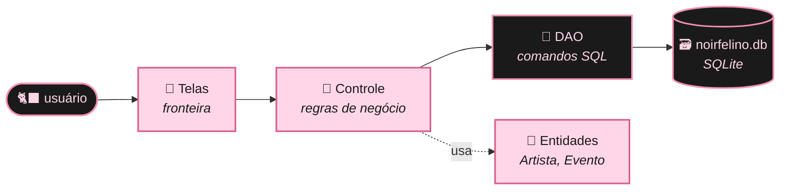
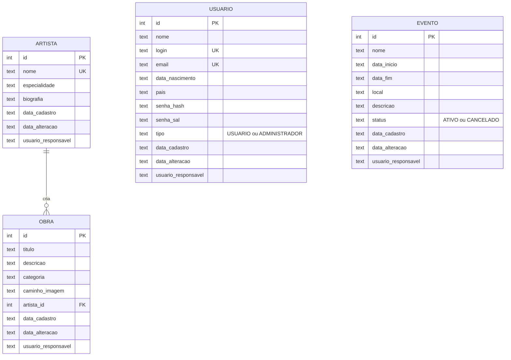

<div align="center">


<br><br>


<sub>˚ ༘ ♡ ⋆｡˚ &nbsp; um cantinho digital para celebrar a arte dos gatos pretos &nbsp; ˚｡⋆ ♡ ༘ ˚</sub>

</div>

<br>

## 🎀 sobre o projeto

O **Noir Felino** é uma plataforma para divulgar, valorizar e organizar obras de arte, artistas e eventos sobre **gatos pretos**, com foco artístico, cultural e informativo. Por muito tempo esses bichanos carregaram fama de azar; aqui eles são os protagonistas. 🖤

Este repositório guarda o **protótipo desktop** do sistema, feito em Java Swing com banco de dados SQLite, desenvolvido na disciplina de **Desenvolvimento para Desktop** do Curso Técnico em Informática Integrado ao Ensino Médio do **IF Goiano – Campus Cristalina**.

<p align="center">⋆｡‧˚ʚ 🎀 ɞ˚‧｡⋆</p>

## 🐈‍⬛ o que já funciona

| | funcionalidade | detalhes |
|:---:|---|---|
| 🔐 | **Login** | usuário, senha e tipo de acesso conferidos no banco; a senha fica guardada com hash |
| 🐾 | **Criar conta** | cadastro de novos usuários direto na tela de login, com as regras RN13 e RN14 |
| 🎨 | **Gerenciar artistas** <sub>(CSU02)</sub> | cadastrar, editar e excluir artistas, vendo quantas obras cada um tem |
| 🗓️ | **Eventos temáticos** <sub>(CSU03)</sub> | cadastrar, editar e cancelar eventos e exposições, com a situação colorida na tabela |
| 🗃️ | **Banco SQLite** | um único arquivo, criado sozinho na primeira execução, já com dados de exemplo |
| 📜 | **14 regras de negócio** | cada regra quebrada mostra uma mensagem com o código dela (ex.: *RN06*) |
| 🕰️ | **Registro de alterações** | todo cadastro ou edição guarda quem fez e quando |

> [!TIP]
> Não precisa instalar XAMPP nem MySQL. O banco é o arquivo `noirfelino.db`, e o driver já vem na pasta `lib/`. É só abrir e rodar ♡

<p align="center">⋆｡‧˚ʚ 🎀 ɞ˚‧｡⋆</p>

## 🌙 vitrine

<div align="center">


<sub>♡ gerenciar artistas ♡</sub>

<br><br>


<sub>♡ eventos e exposições: agendado, em andamento, encerrado ou cancelado ♡</sub>

</div>

<p align="center">⋆｡‧˚ʚ 🎀 ɞ˚‧｡⋆</p>

## 🪄 como rodar

**Você vai precisar de:** JDK 17 ou mais recente e o Eclipse IDE.

1. Baixe ou clone este repositório.
2. No Eclipse, vá em **File › Import › General › Existing Projects into Workspace**.
3. Escolha a pasta do projeto e clique em **Finish**.
4. Clique com o botão direito em `MenuPrincipal.java` › **Run As › Java Application**. 🐾

O sistema abre na **tela de login**. Dá para criar uma conta nova pelo botão **Criar conta** (contas criadas assim são sempre do tipo *Usuário*) ou usar os que já vêm no banco:

| usuário | senha | tipo de acesso |
|---|---|---|
| `admin` | `1234` | Administrador |
| `usuario` | `1234` | Usuário |

Na primeira execução o arquivo `noirfelino.db` aparece na pasta do projeto (aperte <kbd>F5</kbd> no Eclipse para vê-lo).

<details>
<summary><b>🐾 prefere rodar pelo terminal?</b></summary>

<br>

```bash
# compilar
javac -encoding UTF-8 -cp lib/sqlite-jdbc-3.50.3.0.jar -d bin src/*.java

# executar no Linux / macOS
java -cp "bin:lib/sqlite-jdbc-3.50.3.0.jar" MenuPrincipal

# executar no Windows
java -cp "bin;lib/sqlite-jdbc-3.50.3.0.jar" MenuPrincipal
```

</details>

<details>
<summary><b>🧺 dicas sobre o banco de dados</b></summary>

<br>

- **Fazer backup:** feche o sistema e copie o arquivo `noirfelino.db`.
- **Recomeçar do zero:** feche o sistema e apague `noirfelino.db`; ele volta com os dados de exemplo.
- **Ver as tabelas por fora:** use o [DB Browser for SQLite](https://sqlitebrowser.org/) (feche-o antes de rodar o sistema).
- **Erro "Driver do SQLite não encontrado":** botão direito no projeto › Build Path › Configure Build Path › Libraries › Add JARs › `lib/sqlite-jdbc-3.50.3.0.jar`.

</details>

<p align="center">⋆｡‧˚ʚ 🎀 ɞ˚‧｡⋆</p>

## 🏛️ arquitetura

O código segue a mesma divisão da análise de robustez do documento de modelagem: **fronteira › controle › entidade**.



<p align="center">⋆｡‧˚ʚ 🎀 ɞ˚‧｡⋆</p>

## 🗄️ banco de dados



<sub>A tabela `obra` já existe para o próximo caso de uso (CSU01) e garante que um artista com obras não seja excluído.</sub>

<p align="center">⋆｡‧˚ʚ 🎀 ɞ˚‧｡⋆</p>

## 📜 regras de negócio

<details>
<summary><b>♡ ver as 14 regras ♡</b></summary>

<br>

| código | regra | onde vale |
|:---:|---|:---:|
| **RN01** | Nome do artista obrigatório (2 a 100 caracteres); especialidade até 60 e biografia até 1000 | artistas |
| **RN02** | Não podem existir dois artistas com o mesmo nome (sem diferenciar maiúsculas) | artistas |
| **RN03** | Artista com obras associadas não pode ser excluído | artistas |
| **RN04** | Nome, data de início, data de término e local do evento são obrigatórios | eventos |
| **RN05** | Datas no formato dd/mm/aaaa e que existam no calendário (31/02 não vale) | eventos |
| **RN06** | A data de término não pode ser anterior à de início | eventos |
| **RN07** | Um evento não pode ser cadastrado com início no passado | eventos |
| **RN08** | Não podem existir dois eventos ativos com o mesmo nome e a mesma data de início | eventos |
| **RN09** | Cancelar não apaga: o evento fica como *Cancelado* e continua no histórico | eventos |
| **RN10** | Evento cancelado ou encerrado não pode ser editado nem cancelado | eventos |
| **RN11** | Excluir ou cancelar sempre pede confirmação | geral |
| **RN12** | Todo cadastro ou alteração registra data, hora e usuário responsável | geral |
| **RN13** | Nome, usuário, e-mail e senha são obrigatórios; senha com 6+ caracteres e confirmada; aceitar os termos | usuários |
| **RN14** | Não podem existir dois usuários com o mesmo login ou o mesmo e-mail | usuários |

A descrição completa, com os requisitos relacionados, está em [`REGRAS_DE_NEGOCIO.txt`](REGRAS_DE_NEGOCIO.txt).

</details>

<p align="center">⋆｡‧˚ʚ 🎀 ɞ˚‧｡⋆</p>

## 🧶 próximos passos

- [x] Gerenciar artistas <sub>(CSU02)</sub>
- [x] Cadastrar e gerenciar eventos temáticos <sub>(CSU03)</sub>
- [x] Persistência em SQLite com regras de negócio
- [ ] Cadastrar obra artística <sub>(CSU01)</sub>
- [ ] Galeria interativa de obras <sub>(CSU04)</sub>
- [ ] Registrar venda de obra <sub>(CSU05)</sub>
- [ ] Conteúdos educativos sobre gatos pretos <sub>(CSU06)</sub>
- [ ] Administrar conteúdos <sub>(CSU07)</sub>
- [ ] Gerenciar exposições artísticas <sub>(CSU08)</sub>
- [ ] Relatórios de obras e exposições <sub>(CSU09)</sub>
- [ ] Favoritar e avaliar obras <sub>(CSU10)</sub>
- [x] Tela de login
- [x] Cadastro de usuários

<p align="center">⋆｡‧˚ʚ 🎀 ɞ˚‧｡⋆</p>

## 📁 estrutura

```
NoirFelinoPrototipo/
├── 🎀 src/
│   ├── Login.java                tela de login · fronteira
│   ├── CadastroUsuario.java      tela "Criar conta" · fronteira
│   ├── MenuPrincipal.java        tela inicial
│   ├── TelaArtistas.java         CSU02 · fronteira
│   ├── TelaEventos.java          CSU03 · fronteira
│   ├── ControleArtista.java      regras RN01–RN03
│   ├── ControleEvento.java       regras RN04–RN10
│   ├── ControleUsuario.java      login + regras RN13–RN14
│   ├── Artista.java              entidade
│   ├── Evento.java               entidade
│   ├── Usuario.java              entidade
│   ├── ArtistaDAO.java           SQL de artistas
│   ├── EventoDAO.java            SQL de eventos
│   ├── UsuarioDAO.java           SQL de usuários
│   ├── Senhas.java               hash das senhas (SHA-256 + sal)
│   ├── Conexao.java              conexão SQLite + criação das tabelas
│   ├── Datas.java                datas dd/mm/aaaa ⇄ banco
│   ├── Sessao.java               usuário atual
│   ├── Mensagens.java            caixas de diálogo
│   └── RegraNegocioException.java
├── 🧶 lib/
│   └── sqlite-jdbc-3.50.3.0.jar  driver do SQLite
└── 📜 REGRAS_DE_NEGOCIO.txt
```

<p align="center">⋆｡‧˚ʚ 🎀 ɞ˚‧｡⋆</p>

## 🐾 equipe · grupo gato preto

<div align="center">

| 🐈‍⬛ | integrante |
|:---:|---|
| 🎀 | **Yasmin Cristina da Silva Dantas** · *coordenadora* |
| 🖤 | **Ana Paula de Oliveira Dias** |
| 🖤 | **André Rodrigues Machado** |
| 🖤 | **Danilo Monteiro dos Santos** |
| 🖤 | **Gabriele Bispo de Araújo Frazão** |

<sub>orientação: Prof. Norton Guimarães · Desenvolvimento para Desktop</sub>

</div>

<br>

> [!NOTE]
> **🔮 curiosidade felina:** enquanto em muitos lugares o gato preto ganhou fama de azar, no Reino Unido e no Japão ele é tradicionalmente visto como sinal de **boa sorte**. ✨

<br>

<div align="center">

```
    ᓚᘏᗢ   ♡   /ᐠ｡ꞈ｡ᐟ\   ♡   ᓚᘏᗢ
```

<sub>feito com 🖤 e 🎀 pelo grupo Gato Preto · IF Goiano – Campus Cristalina · 2026</sub>

<sub>projeto acadêmico, sem fins comerciais</sub>

</div>
